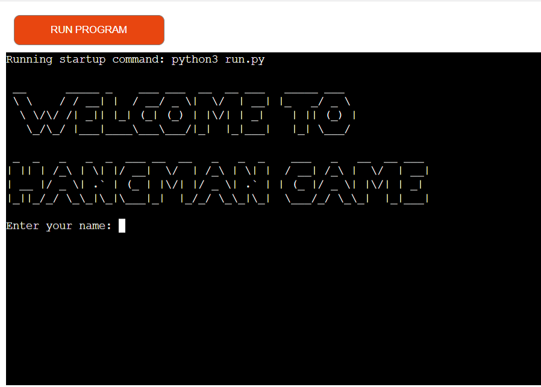
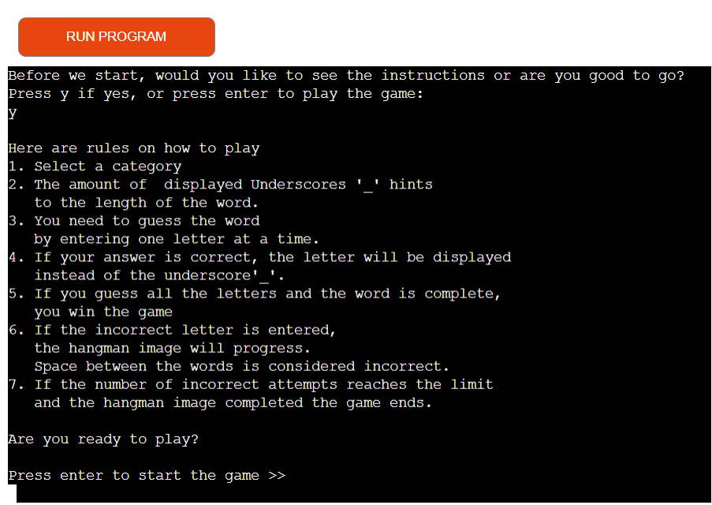
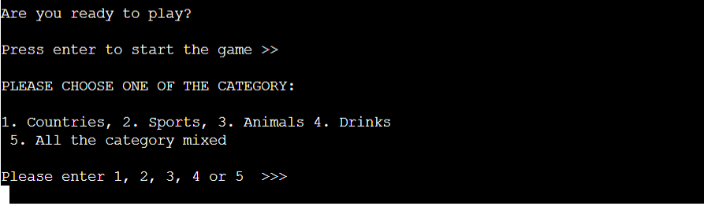
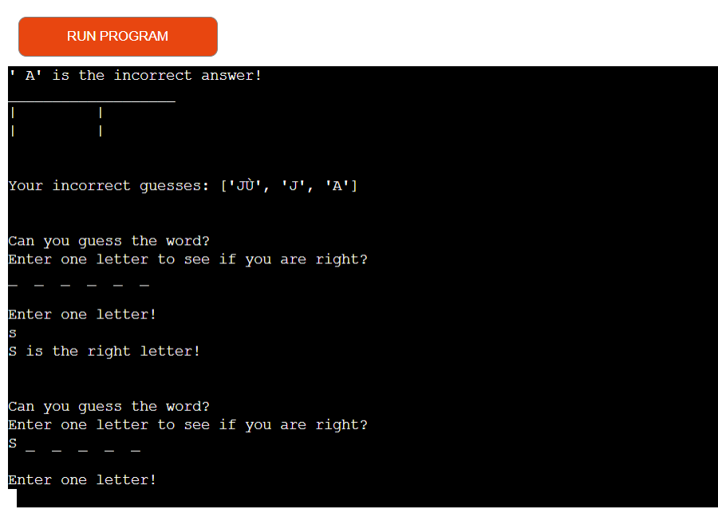
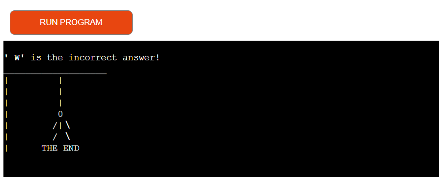
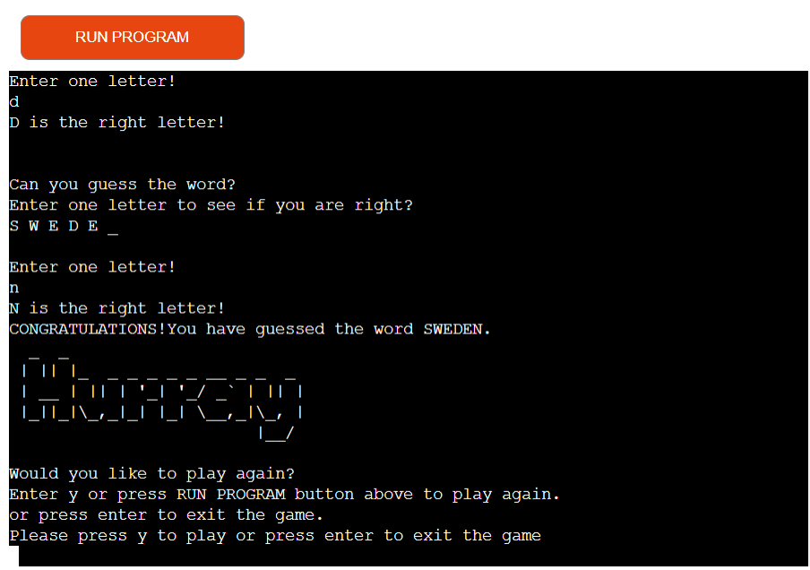
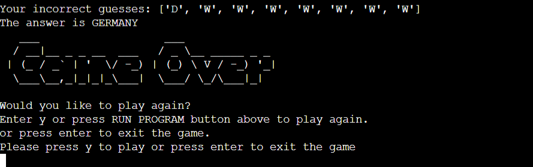

# HANGMAN ON WORDLE

Hangman is a game usually played by two or more people, where one person thinks of a word while the others guess what the word is by guessing one letter at a time until the whole word is revealed.
For this project I wanted to create a version of this game that you can play against the computer rather than playing against another person.
This is done by using python to generate the word and check if the user's guesses are correct, incorrect, invalid or if the user has already guessed the letter.

[Here is the live version of my project](https://hangman-on-wordle.herokuapp.com/)

# How to play

* If you know how to play the game you can start the game, otherwise you can read about how to play the game.

* You will have to choose on which category to select

* You will be presented with a number of blank spaces representing the missing letters you need to find.

* Use the keyboard to guess a letter (I recommend starting with vowels).

* If your chosen letter exists in the answer, then all places in the answer where that letter appears will be revealed.

* After you've revealed several letters, you may be able to guess what the answer is and fill in the remaining letters.

* Every time you guess a letter wrong you lose a life and the hangman begins to appear, piece by piece.

* To win you need to solve the puzzle before the hangman dies.

# Features

### Exsisting Features (with functions)

   * Display greeting , ASCII art, user input for name 
      * def display_greeting()

 
   * Ask the player either display the rules or go for game
      * def display_rules()
   * Display rules
      * def rules_txt()

   * Display categories
   * User input for selecting category  
      * def category_select()

   * Ask the player to enter letters one at the time
   * if the player entered a letter that is right for the randomly selected word,
      the letter will be displayed instead of the "_" underscore
   * if the player enters a letter that is not in the word, the hangman image starts to 
      develop
   * The player gets a note when double selected the same letter  
      * def select_question()   
      * def hangman()
      * def display_guess_message()
      * def display_alredy_used()

   

   * If the user guessed all letters, display ASCII image - Hurray!  
      * def hangman()

  
   * end of game display image ASCII art 
   * ask the player would he like to play again or exit the game using a keyboard or Run Programm button above
   * user input what choice he made
      * def game_over()
      * def replay()