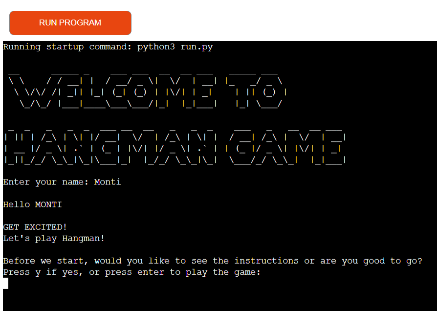

# HANGMAN ON WORDLE

Hangman is a game usually played by two or more people, where one person thinks of a word while the others guess what the word is by guessing one letter at a time until the whole word is revealed.
For this project I wanted to create a version of this game that you can play against the computer rather than playing against another person.
This is done by using python to generate the word and check if the user's guesses are correct, incorrect, invalid or if the user has already guessed the letter.

[Here is the live version of my project](https://hangman-on-wordle.herokuapp.com/)

# How to play

* If you know how to play the game you can start the game, otherwise you can read about how to play the game.

* You will have to choose on which category to select

* You will be presented with a number of blank spaces representing the missing letters you need to find.

* Use the keyboard to guess a letter (I recommend starting with vowels).

* If your chosen letter exists in the answer, then all places in the answer where that letter appears will be revealed.

* After you've revealed several letters, you may be able to guess what the answer is and fill in the remaining letters.

* Every time you guess a letter wrong you lose a life and the hangman begins to appear, piece by piece.

* To win you need to solve the puzzle before the hangman dies.

# Features

### Exsisting Features (with functions)

   * Display greeting , ASCII art, user input for name 
      * def display_greeting()

 
   * Ask the player either display the rules or go for game
      * def display_rules()
   * Display rules
      * def rules_txt()

   * Display categories
   * User input for selecting category  
      * def category_select()

   * Ask the player to enter letters one at the time
   * if the player entered a letter that is right for the randomly selected word,
      the letter will be displayed instead of the "_" underscore
   * if the player enters a letter that is not in the word, the hangman image starts to 
      develop
   * The player gets a note when double selected the same letter  
      * def select_question()   
      * def hangman()
      * def display_guess_message()
      * def display_alredy_used()

   

   * If the user guessed all letters, display ASCII image - Hurray!  
      * def hangman()

  
   * end of game display image ASCII art 
   * ask the player would he like to play again or exit the game using a keyboard or Run Programm button above
   * user input what choice he made
      * def game_over()
      * def replay()

### Future Features

* The Hangman game is an old, old game, and seeing the game's title as a children's game can be odd. Taking into consideration mental health and suicide issues. So for that reason, I would like to give different visualisation options where you can select build a snowman or melting snowman.

* more categories to select

* bigger list of words. Special file to accommodate that.

* for a language learning purpose it would be good to hear the words sound.

* the letters can be displayed for selection

* different difficulty levels 

# Data Model

This is the flowchart made during the planning stage of the project. This flowchart has been used to visualise the functions and behavior control during the building stage of the project.

* Flowchart

# Technology

*  This game was created with:

    * [Gitpod](https://www.gitpod.io/) used to develop a project and organise version control 

    * [Github](https://github.com) used to host repository
       
    * [Heroku](https://id.heroku.com/login) used to deploy my application

* [Lucid](https://lucid.app/users/login#/login) used to create the flowchart for the project.

* [Grammarly](https://app.grammarly.com/) used to fix the thousands of grammar errors across the project.

* The Code Institute's GitHub [python-essentials-template](https://github.com/Code-Institute-Org/python-essentials-template) for Python is used in order for the program to display properly in the deployed site on Heroku.

* [random](https://docs.python.org/3/library/random.html) to randomize anagram

* [time](https://docs.python.org/3/library/time.html) to slow down printed statements

* [Python 3](https://www.python.org/) - an interpreted high-level general-purpose backend programming language.

# Testing

I have manually tested this project by doing the following: 
* Passed the code through a PEP8 linter and confirmed, there are no problems (find under validator testing)
* Give invalid inputs strings when numbers are expected, out of bound inputs, some inputs twice

Tested only numbers are permitted

## Validator Testings

* [PEP8](http://pep8online.com/checkresult)
    * No errors were returned from PEP8online.com

## Bugs

### Solved Bugs

* Heroku, the deployment terminal was set to 80 columns and 24 rows.

At first, I was just writing lines and after error showing fixed-line length.

* ASCII art gave lots of white space, which needed to be fixed by deleting them. 

I selected for every image different font. Block element font was easy to fix.

Image "Game over" is created using line art and it was impossible to solve 
* errors
   * flake8(W605)
   * pylint(anomalous-backslash-in-string)

## Remaining Bugs

* No bugs remaining

# Deployment

This project was deployed using Code Institute's mock terminal for Heroku. Please follow the below steps.

## Deployment steps

1. Git add and git commit the changes made

2. Log into [Heroku](https://id.heroku.com/login) or create a new account and log in

3. top right-hand corner click "New" and choose the option Create new app, if you are a new user, the "Create new app" button will appear in the middle of the screen

4. Write app name - it has to be unique, it cannot be the same as this app

5. Choose Region - I am in Europe

6. Click "Create App" The page of your project opens.

7.  Choose "settings" from the menu on the top of the page

8. Go to section "Config Vars" and click the button "Reveal Config Vars"

9. In the field for "KEY" enter "PORT"-  capital letters and value"8000" 

10. Go to section "Build packs" and click "Add build pack"

   * in this new window - click Python and "Save changes" [`Heroku/Python`]
   * click "Add build pack" again
   * in this new window - click Node.js and "Save changes" [`Heroku/NodeJS`]
   * take care to have those apps in this order: [`Python`] first, [`Node.js`] second, drag and drop if needed

11. Next go to "Deploy" in the menu bar on the top

12. Go to section "deployment method", choose "GitHub"

13. New section will appear "Connect to GitHub" - Search for the repository to connect to

14. type the name of your repository and click "search"

15. once Heroku finds your repository - click "connect"

16. Scroll down to the section "Automatic Deploys"

17. Click "Enable automatic deploys" or choose "Deploy branch" and manually deploy
   * As I wanted to have control over when to deploy the version, I have chosen manual deployment by pressing the Deploy branch button instead of Enable Automatic Deploys 

18. Click "Deploy branch"

Once the program runs: you should see the message "the app was successfully deployed"

 19. Click the button "View". This View button will open the terminal game in the new window. Here is the deployed page [hangman-on-wordle](https://hangman-on-wordle.herokuapp.com/)

 20. As manual deployment was chosen, I had to come back to the Heroku deployment page whenever I have an updated working version pushed into the GitHub page.

# Credits

* Code Institute for the deployment terminal

* To create the game I got help [from](http://inventwithpython.com/invent4thed/chapter8.html)

* Idea for [flowchart](http://inventwithpython.com/invent4thed/chapter7.html)

* My mentor Marcel for encouraging me throughout the project.